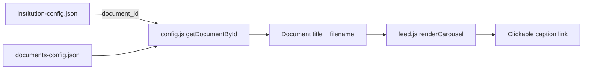
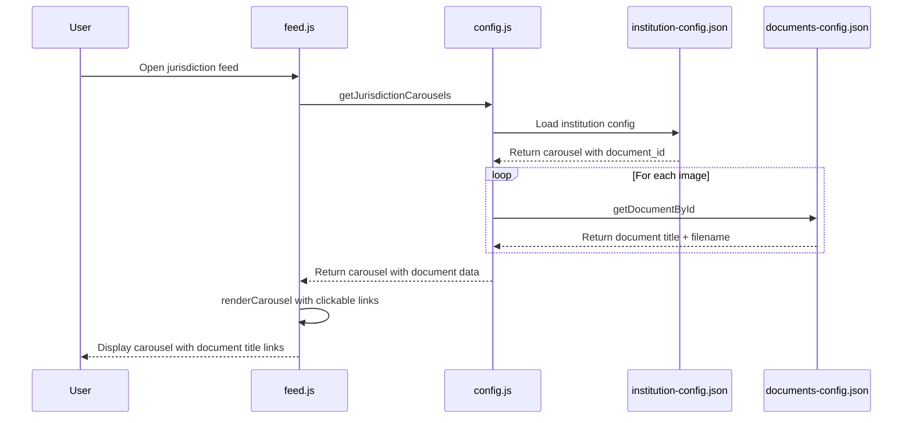

# Plan: Carousel Caption Using Document Title

## Overview

Change the carousel caption in the jurisdiction feed to use real document titles instead of custom hardcoded captions. The document title will be fetched from `documents-config.json` and will be clickable, redirecting users to the document page.

## Current Implementation

### Current Data Flow


### Current Schema in institution-config.json

```json
{
  "carousel": {
    "title": "Media Updates",
    "images": [
      {
        "url": "./images/carousel/media-1.webp",
        "caption": "New Broadcast"
      }
    ],
    "post_to_jurisdictions": ["Borneo [Region]"]
  }
}
```

## Proposed Implementation

### New Data Flow



### New Schema in institution-config.json

```json
{
  "carousel": {
    "title": "Media Updates",
    "images": [
      {
        "url": "./images/carousel/media-1.webp",
        "document_id": "decision2"
      }
    ],
    "post_to_jurisdictions": ["Borneo [Region]"]
  }
}
```

## Business Rule

**Institutions can only post carousels in jurisdiction feeds if they have a document posted in that jurisdiction.**

This is validated by:
1. The `document_id` must exist in `documents-config.json`
2. The document's `institution` must match the carousel owner
3. The document's `jurisdiction` must match the `post_to_jurisdictions` target

## Implementation Steps

### Step 1: Update institution-config.json Schema

**File:** `config/institution-config.json`

Replace the `caption` field with `document_id` in carousel images:

| Institution | Old Caption | New document_id | Document Title |
|-------------|-------------|-----------------|----------------|
| Ummah Media Worldwide | New Broadcast | decision2 | Decision II — Media Establishment |
| Ummah Education Ministry | New Curriculum | decision1 | Decision I — Education Ministry Establishment |
| 101 FnB | New Menu | decision3 | Decision III — FnB Industry Establishment |
| Techplaza | New Product | Decision4 | Decision IV — Tech Industry Establishment |

### Step 2: Add Document Fetching Function in config.js

**File:** `js/config.js`

Add a new exported function:

```javascript
/**
 * Get document by ID
 * @param {string} documentId - The document ID
 * @returns {Promise<Object|null>} The document object or null if not found
 */
export async function getDocumentById(documentId) {
  const config = await loadDocumentsConfig();
  return config.documents.find(doc => doc.id === documentId) || null;
}
```

### Step 3: Update getJurisdictionCarousels in config.js

**File:** `js/config.js`

Modify the function to include document data:

```javascript
export async function getJurisdictionCarousels(jurisdictionName) {
  const config = await loadInstitutionConfig();
  const carousels = [];

  for (const [instName, instData] of Object.entries(config.institutions || {})) {
    const carousel = instData.feed_config?.carousel;
    if (carousel && carousel.post_to_jurisdictions?.includes(jurisdictionName)) {
      // Fetch document data for each image
      const imagesWithDocs = await Promise.all(
        carousel.images.map(async (img) => {
          const doc = img.document_id ? await getDocumentById(img.document_id) : null;
          return {
            ...img,
            document: doc
          };
        })
      );
      
      carousels.push({
        institution: instName,
        ...carousel,
        images: imagesWithDocs
      });
    }
  }

  return carousels;
}
```

### Step 4: Update renderCarousel in feed.js

**File:** `js/feed.js`

Modify the carousel rendering to use document titles as clickable links:

```javascript
function renderCarousel(carousel, sourceName, feedType) {
  // ... existing code ...
  
  const carouselHTML = `
    <div class="feed-carousel" id="${carouselId}">
      <div class="carousel-header">
        <h3 class="carousel-title">${carousel.title}</h3>
      </div>
      <div class="carousel-container">
        <div class="carousel-track" id="${carouselId}-track">
          ${carousel.images.map((img, i) => {
            const caption = img.document?.title || 'Untitled';
            const docLink = img.document?.filename || '#';
            return `
              <div class="carousel-slide">
                
                <div class="carousel-caption">
                  <a href="${docLink}" class="carousel-caption-link">${caption}</a>
                </div>
              </div>
            `;
          }).join('')}
        </div>
        <!-- ... rest of carousel HTML ... -->
      </div>
    </div>
  `;
  // ... rest of function ...
}
```

### Step 5: Add CSS for Clickable Caption

**File:** `src/styles/_components.css` (or appropriate CSS file)

Add styling for the clickable caption link:

```css
.carousel-caption-link {
  color: inherit;
  text-decoration: none;
  transition: color 0.2s ease;
}

.carousel-caption-link:hover {
  text-decoration: underline;
}
```

## Validation Logic

When an institution posts a carousel to a jurisdiction, the system should validate:

1. **Document exists:** The `document_id` must exist in `documents-config.json`
2. **Institution matches:** The document's `institution` field must match the carousel owner
3. **Jurisdiction matches:** The document's `jurisdiction` field must be in the `post_to_jurisdictions` array

If validation fails, the carousel should not be displayed or should show an error state.

## Files to Modify

| File | Changes |
|------|---------|
| `config/institution-config.json` | Replace `caption` with `document_id` in carousel images |
| `js/config.js` | Add `getDocumentById` function, update `getJurisdictionCarousels` |
| `js/feed.js` | Update `renderCarousel` to use document titles as clickable links |
| `src/styles/_components.css` | Add styles for clickable caption links |

## Mermaid Diagram: Complete Flow



## Summary

This plan changes the carousel caption from a hardcoded custom text to a real document title that:
1. Is fetched from `documents-config.json` using a `document_id` reference
2. Is clickable and redirects to the document page
3. Enforces the rule that institutions must have documents posted in a jurisdiction to post carousels there