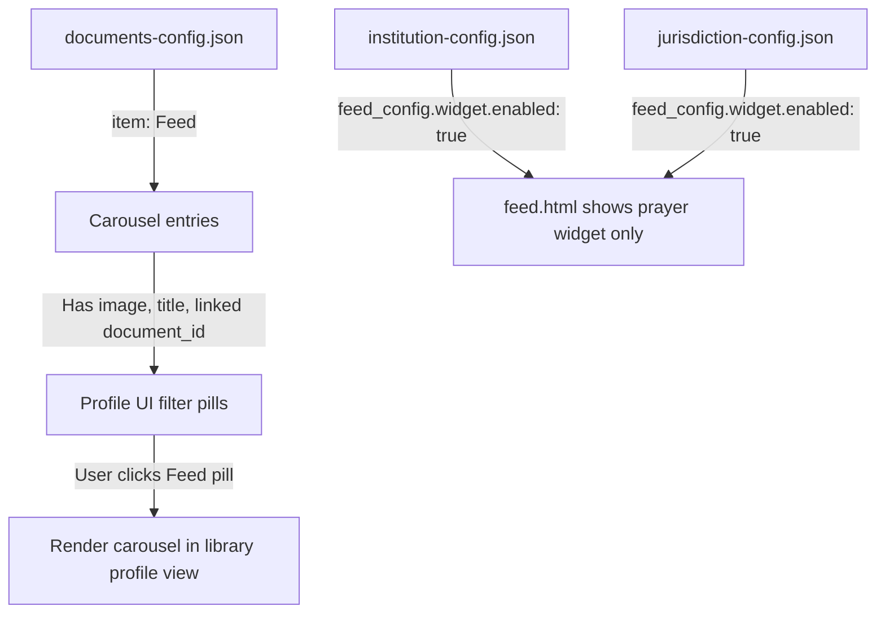
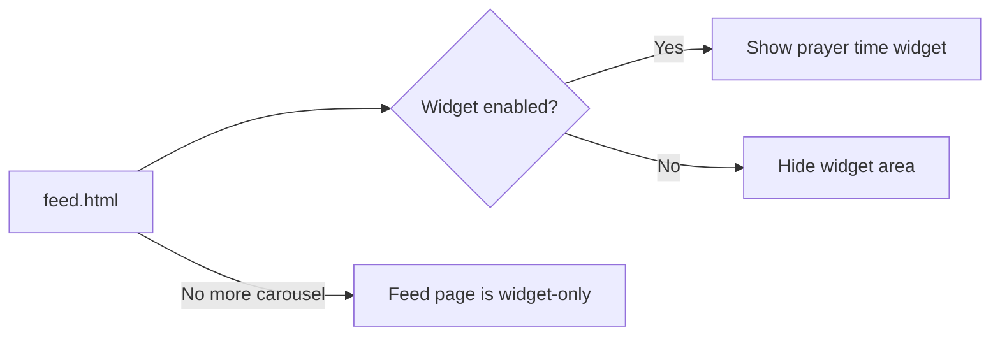

# Carousel Migration Plan

## Summary

Move carousel from the feed page into the library profile mode, treating carousel entries as document-like items in `documents-config.json` rather than storing them in `institution-config.json`.

---

## Current Architecture

- **Carousel data** lives in [`institution-config.json`](config/institution-config.json) under each institution's `feed_config.carousel` property
- [`feed.js`](js/feed.js) reads carousel config via [`getInstitutionFeedConfig()`](js/config.js:302) and [`getJurisdictionCarousels()`](js/config.js:322), then renders carousels on `feed.html`
- [`profile-ui.js`](js/profile-ui.js) renders filter pills based on document `item` types — currently only real documents like Book, Policy, Decision, etc.
- The prayer time widget is controlled by `feed_config.widget.enabled` in both institution and jurisdiction configs

---

## Target Architecture



---

## Detailed Steps

### Step 1: Add carousel entries to `documents-config.json`

Each carousel slide becomes a document entry with `item: "Feed"`. Since carousels dont have their own HTML page, the `filename` field will be empty/null, and a new `carousel` object will hold the visual data.

**New document entry schema:**
```json
{
  "id": "feed-media-1",
  "filename": null,
  "title": "Media Progress",
  "item": "Feed",
  "institution": "Ummah Media Worldwide [Non-Profit * Private]",
  "jurisdiction": "Borneo [Region]",
  "version": 1,
  "date": "2026-02-03T09:00:00",
  "dateFormatted": "03 Feb 2026 | 09:00",
  "visible": true,
  "carousel": {
    "image": "./images/carousel/media-1.webp",
    "linked_document_id": "decision2"
  }
}
```

Key points:
- `item` is `"Feed"` so it appears as a filter pill type
- `institution` and `jurisdiction` fields work exactly like other documents for filtering
- `carousel.image` is the carousel slide image
- `carousel.linked_document_id` references the document this carousel links to
- `filename` is `null` because Feed items dont have their own page

**Entries to migrate** from current [`institution-config.json`](config/institution-config.json):

| Current Institution | Image | Linked Doc | Jurisdiction |
|---|---|---|---|
| Ummah Media Worldwide | media-1.webp | decision2 | Borneo |
| Ummah Education Ministry | education-1.webp | decision1 | Borneo |
| 101 FnB | fnb-1.webp | decision3 | Borneo |
| Techplaza | techplaza-1.webp | Decision4 | Borneo |

### Step 2: Remove carousel data from `institution-config.json`

Remove the `carousel` property from every institution's `feed_config`. Keep only the `widget` property.

### Step 3: Enable prayer time widget for ALL institutions and jurisdictions

Set `feed_config.widget.enabled` to `true` for every institution and jurisdiction in both config files. This means:

- In [`institution-config.json`](config/institution-config.json): Set `enabled: true` for `101 FnB`, `Techplaza`, and `Fathan Husna` — currently `false`
- In [`jurisdiction-config.json`](config/jurisdiction-config.json): Set `enabled: true` for `Borneo [Region]` — currently `false`

### Step 4: Update `config.js` — add Feed document support

- Remove [`getJurisdictionCarousels()`](js/config.js:322) function — no longer needed
- Add a new function `getCarouselDocuments(profileType, profileName)` that filters documents with `item === "Feed"` by institution or jurisdiction
- Update [`getDocumentById()`](js/config.js:356) if needed to resolve `carousel.linked_document_id`

### Step 5: Update `profile-ui.js` — add Feed filter pill and carousel rendering

- The [`getTypeIcon()`](js/profile-ui.js:280) function needs a new icon for `"feed"` type — suggest `📰`
- When the `"Feed"` filter pill is selected, instead of rendering document cards, render carousel slides
- Move the carousel rendering logic from [`feed.js`](js/feed.js:369) — specifically [`renderCarousel()`](js/feed.js:369) and [`initCarouselNavigation()`](js/feed.js:426) — into `profile-ui.js` or a shared carousel module
- The carousel should display in the document list area when Feed filter is active

### Step 6: Update `marquee.js` — remove carousel references from marquee

The marquee currently reads carousel data from institution config via [`fetchFeedConfig()`](js/marquee.js:184) and displays carousel titles in the scrolling text via [`updateDisplay()`](js/marquee.js:236).

Changes needed:
- In [`fetchFeedConfig()`](js/marquee.js:184): Remove the call to `getJurisdictionCarousels()` at line 198 and the `carousels` property merge
- In [`updateDisplay()`](js/marquee.js:236): Remove the carousel content section (lines 268-298) that builds `carouselContent` from `this.feedConfig.carousel` and `this.feedConfig.carousels`
- Instead, fetch Feed-type documents from `documents-config.json` and display their titles in the marquee as the carousel replacement
- Update [`generateContentHash()`](js/marquee.js:359) to reflect the new data source
- Since all widgets are now enabled, the marquee will always show prayer time data plus Feed document titles

### Step 7: Update `feed.js` — remove carousel logic

Remove from [`feed.js`](js/feed.js):
- [`initInstitutionFeed()`](js/feed.js:274) — remove carousel section, keep only widget init
- [`initJurisdictionFeed()`](js/feed.js:324) — remove carousel section, keep only widget init
- [`renderCarousel()`](js/feed.js:369) — move to profile-ui.js or shared module
- [`initCarouselNavigation()`](js/feed.js:426) — move to profile-ui.js or shared module
- [`clearCarousels()`](js/feed.js:354) — move or remove

### Step 8: Update `library-main.js` — handle Feed filter in profile mode

- When profile filter changes to `"Feed"`, the callback in [`library-main.js`](js/library-main.js:76) should trigger carousel rendering instead of document list rendering
- The [`getFilteredDocuments()`](js/profile-ui.js:332) function will return Feed-type documents, which need special rendering

### Step 9: Verify CSS carousel styles still work

- The carousel CSS classes in [`_components.css`](src/styles/_components.css) should still apply since we are reusing the same HTML structure
- May need minor adjustments for the carousel appearing inside the library profile view instead of the feed page

---

## Files to Modify

| File | Action |
|---|---|
| [`config/documents-config.json`](config/documents-config.json) | Add 4 Feed-type carousel entries |
| [`config/institution-config.json`](config/institution-config.json) | Remove carousel data, enable widget for all |
| [`config/jurisdiction-config.json`](config/jurisdiction-config.json) | Enable widget for Borneo |
| [`js/config.js`](js/config.js) | Remove getJurisdictionCarousels, add carousel doc helpers |
| [`js/marquee.js`](js/marquee.js) | Remove carousel references, use Feed documents for marquee text |
| [`js/feed.js`](js/feed.js) | Remove carousel rendering, simplify to widget-only |
| [`js/profile-ui.js`](js/profile-ui.js) | Add Feed pill icon, carousel rendering in profile |
| [`js/library-main.js`](js/library-main.js) | Handle Feed filter type for carousel display |

---

## Data Flow After Migration


## Feed Page After Migration


