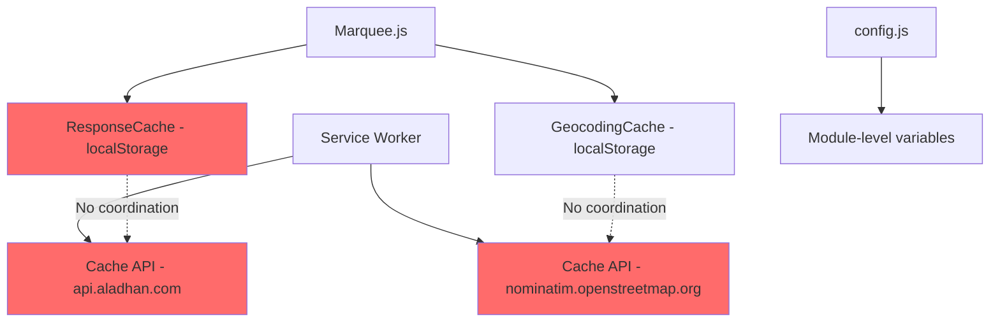

# Marquee Prayer Time Fetching Analysis

## Executive Summary

The marquee prayer time fetching has **multiple fundamental issues** stemming from a chaotic caching architecture and problematic geolocation handling. The caching system is not fundamentally flawed in design, but the **implementation and coordination between layers is problematic**.

---

## Identified Issues

### 1. **CRITICAL: Silent Geolocation Failure** 
**Location:** [`marquee.js:295-308`](js/marquee.js:295)

```javascript
(error) => {
  // Default to Jakarta if geolocation fails
  console.warn("Geolocation failed, using default location (Jakarta):", error);
  this.location = {
    latitude: -6.2088,
    longitude: 106.8456,
    city: "Jakarta",
    country: "Indonesia",
  };
  resolve(this.location);  // ❌ RESOLVES instead of rejecting!
}
```

**Problem:** When GPS fails or is denied, the error handler **resolves** with Jakarta coordinates instead of rejecting. This creates a silent failure where:
- User thinks GPS is working
- Prayer times show for Jakarta, not their actual location
- No visible error indication to the user

---

### 2. **Cache Key Dependency on Unreliable Location**
**Location:** [`marquee.js:34-39`](js/marquee.js:34)

```javascript
getCacheKey() {
  const today = new Date();
  const dateStr = `${today.getFullYear()}-${today.getMonth() + 1}-${today.getDate()}`;
  const locationStr = `${this.location?.latitude?.toFixed(2)}_${this.location?.longitude?.toFixed(2)}`;
  return `${this.cacheKey}_${dateStr}_${locationStr}`;
}
```

**Problem:** 
- Cache key depends on `this.location` which may be Jakarta fallback
- Creates cache pollution - wrong location data gets cached
- Users may get cached Jakarta times even after GPS starts working

---

### 3. **Multiple Uncoordinated Caching Layers**



**Problem:**
- `ResponseCache` uses localStorage with TTL
- Service Worker uses Cache API with different TTL (5 min)
- No invalidation coordination between layers
- Can serve stale data from one cache while another is fresh

---

### 4. **No GPS Permission Pre-Check**
**Location:** [`marquee.js:243-248`](js/marquee.js:243)

```javascript
async getLocation() {
  return new Promise((resolve, reject) => {
    if (!navigator.geolocation) {
      reject(new Error("Geolocation is not supported by your browser"));
      return;
    }
    // ❌ No permission state check before getCurrentPosition
    navigator.geolocation.getCurrentPosition(...)
```

**Problem:**
- Doesn't check `navigator.permissions.query({name: 'geolocation'})`
- Can't distinguish between:
  - Permission denied
  - GPS unavailable
  - Timeout
  - Position unavailable

---

### 5. **No Geolocation Timeout Configuration**
**Location:** [`marquee.js:250`](js/marquee.js:250)

```javascript
navigator.geolocation.getCurrentPosition(
  async (position) => { ... },
  (error) => { ... }
  // ❌ No options object with timeout
);
```

**Problem:**
- Default timeout can be very long (infinity in some browsers)
- User perceives app as frozen during GPS fetch
- No feedback during location acquisition

---

### 6. **CORS Proxy Single Point of Failure**
**Location:** [`marquee.js:270-272`](js/marquee.js:270)

```javascript
const response = await fetch(
  `https://corsproxy.io/?${encodeURIComponent(...)}`
);
```

**Problem:**
- Single CORS proxy dependency
- If corsproxy.io is down, geocoding fails
- No fallback proxy or direct API option

---

### 7. **Cache Precision Mismatch**
**Location:** [`marquee.js:258`](js/marquee.js:258) vs [`marquee.js:37`](js/marquee.js:37)

```javascript
// Geocoding cache: 4 decimal places
const geocodingCacheKey = `geocoding_${this.location.latitude.toFixed(4)}_${this.location.longitude.toFixed(4)}`;

// Prayer times cache: 2 decimal places  
const locationStr = `${this.location?.latitude?.toFixed(2)}_${this.location?.longitude?.toFixed(2)}`;
```

**Problem:**
- Same location can create different cache keys
- Precision of 2 decimals = ~1.1km, 4 decimals = ~11m
- Moving 500m creates new prayer cache but same geocoding cache

---

### 8. **IndexedDB Cache Exists But Unused**
**Location:** [`indexeddb-cache.js`](js/indexeddb-cache.js)

**Problem:**
- Full IndexedDB implementation exists
- Marquee only uses localStorage-based `ResponseCache`
- localStorage has 5MB limit, can fail silently when full

---

### 9. **Service Worker API Caching Conflicts**
**Location:** [`sw.js:91-96`](sw.js:91)

```javascript
if (url.hostname === 'api.aladhan.com' || url.hostname === 'nominatim.openstreetmap.org') {
  event.respondWith(networkFirst(request, 5 * 60 * 1000)); // 5 minutes cache
}
```

**Problem:**
- SW caches API responses for 5 minutes
- Marquee caches for 24 hours (end of day)
- Mismatch causes confusion and potential stale data

---

### 10. **No User Feedback During Location Fetch**
**Location:** [`marquee.js:118-166`](js/marquee.js:118)

**Problem:**
- No loading state shown while fetching location
- No indication that GPS permission is being requested
- User sees nothing until entire init completes or fails

---

## Root Cause Analysis


---

## Fundamental Flaws Summary

| Issue | Severity | Impact |
|-------|----------|--------|
| Silent GPS failure | **CRITICAL** | Wrong prayer times displayed |
| No permission pre-check | HIGH | Poor UX, confusing errors |
| Multiple uncoordinated caches | HIGH | Stale data, cache pollution |
| No timeout configuration | MEDIUM | App appears frozen |
| CORS proxy dependency | MEDIUM | Geocoding can fail |
| Cache precision mismatch | LOW | Inefficient caching |
| No IndexedDB usage | LOW | Storage limitations |

---

## Recommended Fix Priority

1. **Fix silent GPS failure** - Reject instead of resolve on error
2. **Add permission pre-check** - Better error handling and UX
3. **Unify caching strategy** - Single source of truth
4. **Add timeout and loading states** - Better UX
5. **Add fallback CORS proxies** - Reliability
6. **Migrate to IndexedDB** - Storage capacity
