# Marquee Prayer Time Fix Plan

## Overview

This plan addresses the fundamental issues with the marquee prayer time fetching system. The fixes are organized into phases based on priority and impact.

---

## Phase 1: Critical Fixes - GPS Location Handling

### 1.1 Fix Silent GPS Failure
**File:** [`js/marquee.js`](js/marquee.js)
**Lines:** 295-308

**Current Behavior:**
```javascript
(error) => {
  console.warn("Geolocation failed, using default location (Jakarta):", error);
  this.location = { latitude: -6.2088, longitude: 106.8456, city: "Jakarta", country: "Indonesia" };
  resolve(this.location);  // Silent failure
}
```

**New Behavior:**
```javascript
(error) => {
  console.warn("Geolocation failed:", error.code, error.message);
  
  // Store error info for UI display
  this.locationError = {
    code: error.code,
    PERMISSION_DENIED: error.PERMISSION_DENIED,
    POSITION_UNAVAILABLE: error.POSITION_UNAVAILABLE,
    TIMEOUT: error.TIMEOUT
  };
  
  // Set fallback location but mark as fallback
  this.location = {
    latitude: -6.2088,
    longitude: 106.8456,
    city: "Jakarta",
    country: "Indonesia",
    isFallback: true  // Flag to indicate this is not real GPS
  };
  
  resolve(this.location);  // Still resolve but with error info
}
```

### 1.2 Add Permission Pre-Check
**File:** [`js/marquee.js`](js/marquee.js)
**New method before getLocation**

```javascript
/**
 * Check geolocation permission state before requesting
 * @returns {Promise<string>} 'granted', 'denied', or 'prompt'
 */
async checkGeolocationPermission() {
  if (!navigator.permissions) {
    return 'prompt';  // Assume prompt if Permissions API not available
  }
  
  try {
    const result = await navigator.permissions.query({ name: 'geolocation' });
    return result.state;  // 'granted', 'denied', or 'prompt'
  } catch (error) {
    return 'prompt';  // Fallback to prompt
  }
}
```

### 1.3 Add Geolocation Timeout Configuration
**File:** [`js/marquee.js`](js/marquee.js)
**Lines:** 250

**Current:**
```javascript
navigator.geolocation.getCurrentPosition(successCallback, errorCallback);
```

**New:**
```javascript
const GEOLOCATION_OPTIONS = {
  enableHighAccuracy: false,  // Faster, less accurate is OK for prayer times
  timeout: 10000,             // 10 seconds max
  maximumAge: 300000          // Accept position up to 5 minutes old
};

navigator.geolocation.getCurrentPosition(successCallback, errorCallback, GEOLOCATION_OPTIONS);
```

---

## Phase 2: Cache Architecture Unification

### 2.1 Create Unified Cache Manager
**New File:** `js/unified-cache.js`

```javascript
/**
 * Unified Cache Manager
 * Single source of truth for all caching operations
 * Coordinates between memory, localStorage, IndexedDB, and Service Worker
 */

import { IndexedDBCache } from './indexeddb-cache.js';

export class UnifiedCacheManager {
  constructor() {
    this.memoryCache = new Map();
    this.idbCache = new IndexedDBCache('ummah-unified-cache');
    this.initialized = false;
  }

  async init() {
    if (this.initialized) return;
    await this.idbCache.init();
    this.initialized = true;
  }

  /**
   * Generate standardized cache key
   */
  generateKey(namespace, ...parts) {
    return `${namespace}:${parts.join(':')}`;
  }

  /**
   * Get from cache - checks memory first, then IndexedDB
   */
  async get(key) {
    // Memory cache (fastest)
    if (this.memoryCache.has(key)) {
      const cached = this.memoryCache.get(key);
      if (Date.now() - cached.timestamp < cached.ttl) {
        return cached.value;
      }
      this.memoryCache.delete(key);
    }

    // IndexedDB (persistent)
    const value = await this.idbCache.get(key);
    if (value !== null) {
      // Restore to memory cache
      this.memoryCache.set(key, { value, timestamp: Date.now(), ttl: 86400000 });
      return value;
    }

    return null;
  }

  /**
   * Set cache - writes to both memory and IndexedDB
   */
  async set(key, value, ttl) {
    const data = { value, timestamp: Date.now(), ttl };
    this.memoryCache.set(key, data);
    await this.idbCache.set(key, value, ttl);
  }

  /**
   * Invalidate all caches for a namespace
   */
  async invalidateNamespace(namespace) {
    // Clear memory cache
    for (const key of this.memoryCache.keys()) {
      if (key.startsWith(namespace + ':')) {
        this.memoryCache.delete(key);
      }
    }
    
    // Clear IndexedDB entries
    const keys = await this.idbCache.keys();
    for (const key of keys) {
      if (key.startsWith(namespace + ':')) {
        await this.idbCache.delete(key);
      }
    }
  }
}

export const unifiedCache = new UnifiedCacheManager();
```

### 2.2 Update Marquee to Use Unified Cache
**File:** [`js/marquee.js`](js/marquee.js)

**Changes:**
1. Import `unifiedCache` instead of creating separate `ResponseCache` instances
2. Use consistent cache key format: `prayer:${date}:${lat}:${lon}`
3. Use consistent precision (4 decimals) for location in cache keys

### 2.3 Update Service Worker to Respect App-Level Caching
**File:** [`sw.js`](sw.js)
**Lines:** 91-96

**Current:**
```javascript
if (url.hostname === 'api.aladhan.com' || url.hostname === 'nominatim.openstreetmap.org') {
  event.respondWith(networkFirst(request, 5 * 60 * 1000));
}
```

**New:**
```javascript
// Let the app handle API caching - SW should not interfere
if (url.hostname === 'api.aladhan.com' || url.hostname === 'nominatim.openstreetmap.org') {
  event.respondWith(fetch(request));  // Pass through, let app cache
  return;
}
```

---

## Phase 3: User Experience Improvements

### 3.1 Add Loading State
**File:** [`js/marquee.js`](js/marquee.js)

```javascript
showLoadingState() {
  if (!this.marqueeElement) return;
  this.marqueeElement.innerHTML = `
    <span class="prayer-loading">
      <span class="loading-spinner"></span>
      Fetching your location...
    </span>
  `;
}

showPermissionDeniedState() {
  if (!this.marqueeElement) return;
  this.marqueeElement.innerHTML = `
    <span class="prayer-warning">
      ⚠️ Location permission denied. Using Jakarta as fallback.
      <button class="retry-btn" onclick="this.requestLocationAgain()">Retry</button>
    </span>
  `;
}
```

### 3.2 Add Visual Indicators for Fallback Location
**File:** [`js/marquee.js`](js/marquee.js)

Update `updateDisplay()` to show when using fallback:
```javascript
const locationText = this.location.isFallback 
  ? `📍 ${this.location.city}, ${this.location.country} (Fallback)`
  : `${this.location.city}, ${this.location.country}`;
```

### 3.3 Add Retry Mechanism
**File:** [`js/marquee.js`](js/marquee.js)

```javascript
async requestLocationAgain() {
  this.showLoadingState();
  try {
    await this.getLocation();
    await this.fetchPrayerTimes();
    this.updateDisplay();
  } catch (error) {
    console.error('Retry failed:', error);
  }
}
```

---

## Phase 4: Reliability Improvements

### 4.1 Add Fallback CORS Proxies
**File:** [`js/marquee.js`](js/marquee.js)

```javascript
const CORS_PROXIES = [
  'https://corsproxy.io/?',
  'https://api.allorigins.win/raw?url=',
  'https://cors-anywhere.herokuapp.com/'  // Requires temporary access
];

async function fetchWithFallbackProxy(url) {
  for (const proxy of CORS_PROXIES) {
    try {
      const response = await fetch(proxy + encodeURIComponent(url), {
        signal: AbortSignal.timeout(5000)  // 5 second timeout
      });
      if (response.ok) return response;
    } catch (error) {
      console.warn(`Proxy ${proxy} failed:`, error);
    }
  }
  throw new Error('All CORS proxies failed');
}
```

### 4.2 Add Network Status Handling
**File:** [`js/marquee.js`](js/marquee.js)

```javascript
handleNetworkChange() {
  if (navigator.onLine) {
    // Network restored, try to refresh
    this.refreshPrayerTimesInBackground();
  } else {
    // Network lost, show cached data with indicator
    console.log('Offline - using cached data');
  }
}

// In init():
window.addEventListener('online', () => this.handleNetworkChange());
window.addEventListener('offline', () => this.handleNetworkChange());
```

---

## Phase 5: Cache Precision Standardization

### 5.1 Standardize Location Precision
**File:** [`js/marquee.js`](js/marquee.js)

Create a constant for location precision:
```javascript
const LOCATION_PRECISION = 4;  // 4 decimals = ~11m accuracy

getLocationString() {
  if (!this.location) return 'unknown';
  return `${this.location.latitude.toFixed(LOCATION_PRECISION)}_${this.location.longitude.toFixed(LOCATION_PRECISION)}`;
}
```

Use this consistently for:
- Prayer times cache key
- Geocoding cache key
- Any location-based caching

---

## Implementation Order

```mermaid
flowchart LR
    subgraph Phase1[Phase 1: Critical]
        A1[Fix silent GPS failure]
        A2[Add permission check]
        A3[Add timeout config]
    end
    
    subgraph Phase2[Phase 2: Architecture]
        B1[Create UnifiedCacheManager]
        B2[Update marquee to use unified cache]
        B3[Update SW to pass through APIs]
    end
    
    subgraph Phase3[Phase 3: UX]
        C1[Add loading state]
        C2[Add fallback indicator]
        C3[Add retry mechanism]
    end
    
    subgraph Phase4[Phase 4: Reliability]
        D1[Add fallback CORS proxies]
        D2[Add network status handling]
    end
    
    subgraph Phase5[Phase 5: Cleanup]
        E1[Standardize precision]
        E2[Remove duplicate caches]
    end
    
    Phase1 --> Phase2 --> Phase3 --> Phase4 --> Phase5
```



---

## Files to Modify

| File | Changes |
|------|---------|
| `js/marquee.js` | Major refactor of location and caching logic |
| `js/cache.js` | Deprecate in favor of unified cache |
| `js/indexeddb-cache.js` | Minor updates if needed |
| `sw.js` | Remove API caching, pass through to app |
| `src/styles/_components.css` | Add loading/permission states styling |

## Files to Create

| File | Purpose |
|------|---------|
| `js/unified-cache.js` | Single source of truth for caching |

---

## Testing Checklist

- [ ] GPS permission granted - shows correct location
- [ ] GPS permission denied - shows fallback with indicator
- [ ] GPS timeout - shows fallback with indicator
- [ ] Offline mode - shows cached data
- [ ] Network restored - refreshes in background
- [ ] CORS proxy down - tries fallback proxies
- [ ] Cache survives page refresh
- [ ] Cache invalidates on day change
- [ ] Cache invalidates on location change > 11m

---

## Risk Assessment

| Risk | Mitigation |
|------|------------|
| Breaking existing functionality | Implement in phases, test each phase |
| IndexedDB not available | Fallback to localStorage |
| All CORS proxies down | Show cached data with offline indicator |
| Permission API not supported | Use try/catch, assume prompt state |
