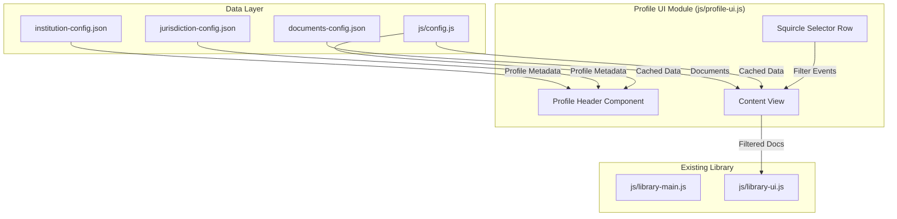

# Social Media-Style Profile UI Implementation Plan

## Overview
Implement a social media-style profile view for institutions and jurisdictions using vanilla JavaScript. This will be integrated into the existing library page, allowing users to view a profile and filter its content using squircle selectors.

## Architecture



## Component Structure

### 1. Profile Header Component
**Location:** New component in `js/profile-ui.js`

**Features:**
- Cover image (full-width banner)
- Avatar (overlapping cover, circular)
- Name (bold title)
- Label (subtitle/badge extracted from brackets)
- Count display (contributions for institutions, contributors for jurisdictions)
- Bio/description text
- Action button (optional)

**Data Source:** 
- `institution-config.json` - for institution profiles (contribution count = document count)
- `jurisdiction-config.json` - for jurisdiction profiles (contributor count = unique institutions)

**Count Logic (Already Exists):**
- **Institution**: Count of documents where `doc.institution === institutionName`
  - Display: "{count} contribution(s)"
- **Jurisdiction**: Count of unique institutions that have posted in this jurisdiction
  - Display: "{count} contributor(s)"

**Extended Config Example:**
```json
// institution-config.json
{
  "institutions": {
    "Ummah Cabinet [Non-Profit • Private]": {
      "avatar": "./images/institutions/ummah-cabinet.png",
      "cover": "./images/covers/ummah-cabinet.jpg",
      "bio": "This is for bio."
    }
  }
}

// jurisdiction-config.json
{
  "jurisdictions": {
    "Ummah Cabinet Members [Team Space]": {
      "avatar": "./images/jurisdictions/ummah-cabinet.jpg",
      "cover": "./images/covers/ummah-cabinet.jpg",
      "bio": "This is for bio."
    }
  }
}
```

### 2. Squircle Selector Row
**Location:** Reuse existing squircle styles from `index.html`, adapt for filtering

**Features:**
- Horizontal row of squircle buttons
- Items: All, Book, Policy, Decision, (other types from data)
- Active state highlighting
- Click to filter content below
- Horizontally Scrollable if many squircle items.

**CSS:** Extend existing `.squircle` and `.squircle-item` classes

### 3. Content View
**Location:** Integrate with existing `js/library-ui.js`

**Features:**
- Reuse existing library row/list components for now
- Filter documents by selected type
- Maintain existing sort functionality, but adjust the ui of sort buttons
- Show "No documents" message when filter returns empty

## File Changes

### New Files
1. **`js/profile-ui.js`** - Profile component logic
2. **`js/profile-filter.js`** - Filter state management (optional, could be in profile-ui.js)

### Modified Files
1. **`institution-config.json`** - Add bio field (avatar and cover already exist)
2. **`jurisdiction-config.json`** - Add bio field (avatar and cover already exist)
3. **`library.html`** - Add profile container and squircle selector markup
4. **`js/library-main.js`** - Initialize profile UI alongside existing library
5. **`js/library-ui.js`** - Add filter integration hooks
6. **`js/config.js`** - Add helper to get jurisdiction metadata
7. **`styles.css`** or inline styles - Profile-specific CSS

## Implementation Steps

### Phase 1: Data Layer
1. Add `bio` field to `institution-config.json` & 'jurisdiction-config.json' (avatar and cover already exist)
3. Add helper function in `js/config.js`

### Phase 2: Profile Component
1. Create `js/profile-ui.js` module
2. Implement `renderProfile(institutionName)` function
3. Load institution metadata and document counts
4. Generate profile header HTML

### Phase 3: Squircle Selector
1. Create `renderSquircleSelectors()` function
2. Dynamically generate selectors based on available document types
3. Add click handlers for filtering

### Phase 4: Integration
1. Modify `library.html` to add profile container
2. Update `js/library-main.js` to initialize profile when institution filter is active
3. Connect squircle filter to existing document list

### Phase 5: Styling
1. Add CSS for profile header layout
2. Style squircle selector row
3. Ensure responsive design

## URL Structure

The profile view will be triggered by URL parameters:
- `library.html?institution=Ummah%20Cabinet` - Shows profile for that institution
- `library.html?institution=Ummah%20Cabinet&item=Book` - Shows profile with Book filter active

## State Management

Simple state object in `js/profile-ui.js`:
```javascript
const profileState = {
  profileType: null, // 'institution' or 'jurisdiction'
  profileName: null, // institution or jurisdiction name
  currentFilter: 'all', // 'all', 'Book', 'Policy', 'Decision', etc.
  documents: [],
  profileData: null
};
```

**Profile Type Detection:**
- If URL has `?institution=...` → Institution profile (show contribution count)
- If URL has `?jurisdiction=...` → Jurisdiction profile (show contributor count)
- If neither → No profile view (show default library)

## Lite Mode Compatibility

**Important:** The profile UI feature is **only for the UI Mode**. The Lite Mode must remain untouched and will not display profiles.

- **Lite Mode** (`index.html` with `lite-mode` div visible): Shows the original registry-style list view without any profile components
- **UI Mode** (`index.html` with `ui-mode` div visible): Has galleries that link to the library with profile view
- **Library Page** (`library.html`): Will show profile header when `?institution=` or `?jurisdiction=` is in URL

The profile UI is conditionally rendered in `library.html` based on URL parameters. When no profile parameter is present, the library displays in its default state without the profile header.

