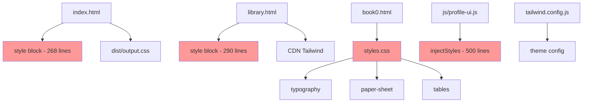
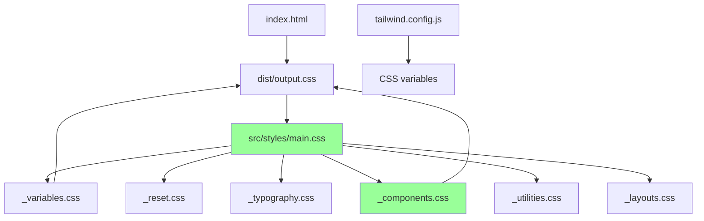

# Styling Refactoring Plan

## Problem Statement
Styling code is scattered across 7 different files/locations, making it difficult to:
- Find and modify styles
- Maintain consistency
- Understand the complete styling system
- Onboard new developers

## Current State Analysis

### Scattered Style Locations

1. **[`styles.css`](styles.css)** (527 lines)
   - Base typography (h1-h4, p, li)
   - Paper sheet component
   - Arabic text styling
   - Tables, images, flags
   - Library row, registry styles
   - Responsive breakpoints (mobile, tablet)
   - Media queries for library layout

2. **[`tailwind.config.js`](tailwind.config.js)** (23 lines)
   - Font families (serif, arabic)
   - Color palette (paper, ink)
   - Background image textures

3. **[`src/input.css`](src/input.css)** (1 line)
   - Tailwind import only

4. **[`index.html`](index.html)** (268 lines in `<style>`)
   - Content gallery (squircle grid)
   - ID card gallery
   - Tab button styles
   - Registry styles (duplicate)
   - Responsive breakpoints (duplicate)

5. **[`library.html`](library.html)** (290 lines in `<style>`)
   - Sort controls (segmented control)
   - Squircle selector row
   - Mobile library rows
   - Profile header styles (partial)
   - Responsive breakpoints (duplicate)

6. **[`js/profile-ui.js`](js/profile-ui.js:157-646)** (~500 lines)
   - Profile header container
   - Cover image, avatar
   - Filter pills
   - All responsive breakpoints
   - Injected via JavaScript

7. **[`js/index-ui.js`](js/index-ui.js)** (inline `style` attributes)
   - Background image URLs

### Duplication Issues
- Paper texture defined in 3 places
- Registry/link hover styles in 2 places
- Responsive breakpoints repeated
- Tailwind config in both JS file and HTML

---

## Proposed Architecture

```
src/
├── styles/
│   ├── _variables.css      # Design tokens (colors, fonts, spacing)
│   ├── _reset.css          # CSS reset
│   ├── _typography.css     # Headings, paragraphs, lists
│   ├── _components.css     # Reusable component classes
│   ├── _layouts.css        # Page layouts
│   ├── _utilities.css      # Utility classes
│   └── main.css            # Main import file
├── js/
│   └── styles.js           # Dynamic style generation (if needed)
dist/
│   └── output.css          # Compiled CSS (for production)
├── index.html
├── library.html
└── ...
```

---

## Refactoring Steps

### Phase 1: Create Design System (Design Tokens)

#### Step 1.1: Create [`src/styles/_variables.css`](src/styles/_variables.css)

```css
:root {
  /* Colors */
  --color-paper: #f5f5f0;
  --color-ink: #1a1a1a;
  --color-black: #000000;
  --color-white: #ffffff;
  --color-gray-100: #f3f4f6;
  --color-gray-600: #6b7280;
  --color-gray-900: #111827;
  --color-accent: #1877f2;
  --color-border: #e4e6eb;

  /* Gradients */
  --gradient-squircle: linear-gradient(135deg, #e3f2fd 0%, #bbdefb 100%);
  --gradient-profile: linear-gradient(135deg, #667eea 0%, #764ba2 100%);

  /* Typography */
  --font-serif: 'Spectral', serif;
  --font-arabic: 'Traditional Arabic', 'Arabic Typesetting', 'Amiri', serif;
  --font-sans: 'Inter', -apple-system, BlinkMacSystemFont, sans-serif;

  /* Spacing */
  --spacing-xs: 0.25rem;
  --spacing-sm: 0.5rem;
  --spacing-md: 1rem;
  --spacing-lg: 1.5rem;
  --spacing-xl: 2rem;

  /* Border Radius */
  --radius-squircle: 22%;
  --radius-card: 12px;
  --radius-pill: 9999px;

  /* Shadows */
  --shadow-card: 0 2px 8px rgba(0, 0, 0, 0.08);
  --shadow-profile: 0 0 20px rgba(0, 0, 0, 0.1);

  /* Transitions */
  --transition-fast: 0.2s ease;
  --transition-normal: 0.3s ease;
}
```

#### Step 1.2: Update [`tailwind.config.js`](tailwind.config.js)

```javascript
module.exports = {
  content: ["./*.html", "./js/**/*.js"],
  theme: {
    extend: {
      colors: {
        paper: 'var(--color-paper)',
        ink: 'var(--color-ink)',
      },
      fontFamily: {
        serif: ['var(--font-serif)', 'serif'],
        arabic: ['var(--font-arabic)', 'serif'],
      },
      backgroundImage: {
        'paper-texture': 'var(--paper-texture)',
        'squircle-gradient': 'var(--gradient-squircle)',
      },
    },
  },
  plugins: [],
}
```

### Phase 2: Consolidate Component Styles

#### Step 2.1: Create [`src/styles/_components.css`](src/styles/_components.css)

```css
/* Paper Sheet Component */
.paper-sheet {
  max-width: 850px;
  width: 100%;
  margin: 0 auto clamp(40px, 8vw, 60px) auto;
  background: var(--color-white);
  background-image: var(--paper-texture);
  background-size: 20px 20px;
  padding: clamp(40px, 8vw, 80px) clamp(20px, 6vw, 100px);
  box-shadow: 0 2px 10px rgba(0, 0, 0, 0.1);
}

/* Registry Component */
.registry a {
  text-decoration: none;
  color: inherit;
}
.registry a:hover {
  text-decoration: underline;
}

/* Library Row Component */
.library-row {
  display: grid;
  grid-template-columns: 1fr 80px 140px;
  align-items: baseline;
  gap: 1rem;
}

/* Sort Controls Component */
.sort-controls {
  display: inline-flex;
  gap: 0.25rem;
  background: var(--color-gray-100);
  border-radius: var(--radius-pill);
  padding: 0.25rem;
}

/* Squircle Item Component */
.squircle-item {
  display: flex;
  flex-direction: column;
  align-items: center;
  text-decoration: none;
  color: inherit;
  transition: transform var(--transition-fast);
}
.squircle {
  width: 100%;
  aspect-ratio: 1;
  background: var(--gradient-squircle);
  border-radius: var(--radius-squircle);
  display: flex;
  align-items: center;
  justify-content: center;
  box-shadow: 0 2px 8px rgba(0, 0, 0, 0.08);
}

/* ID Card Component */
.id-card {
  background: var(--color-white);
  border-radius: var(--radius-card);
  overflow: hidden;
  box-shadow: var(--shadow-card);
  border: 1px solid var(--color-border);
  text-decoration: none;
  color: inherit;
  display: block;
}
```

### Phase 3: Move HTML Inline Styles to CSS Files

#### Step 3.1: Extract [`index.html`](index.html) `<style>` block

Move these styles to [`src/styles/_components.css`](src/styles/_components.css):
- `.content-gallery` and responsive variants
- `.card-gallery` and responsive variants
- `.tab-btn.active` styles
- `.squircle-*` styles
- `.id-card-*` styles

#### Step 3.2: Extract [`library.html`](library.html) `<style>` block

Move these styles to [`src/styles/_components.css`](src/styles/_components.css):
- `.sort-btn` and `.sort-controls` styles
- `.squircle-selector-row` styles
- `.squircle-filter-*` styles
- Mobile library row overrides

### Phase 4: Remove JavaScript-Injected Styles

#### Step 4.1: Extract [`js/profile-ui.js`](js/profile-ui.js:157-646) `injectStyles()`

Move all styles from `injectStyles()` to [`src/styles/_components.css`](src/styles/_components.css):
- `#profile-header` styles
- `.profile-cover`, `.profile-avatar` styles
- `.profile-info`, `.profile-name` styles
- `.filter-pill-*` styles
- All responsive breakpoints

#### Step 4.2: Remove `injectStyles()` function call

Change `injectStyles()` to a no-op or remove the call after moving styles.

### Phase 5: Create Main CSS Import File

#### Step 5.1: Create [`src/styles/main.css`](src/styles/main.css)

```css
@import './_variables.css';
@import './_reset.css';
@import './_typography.css';
@import './_components.css';
@import './_utilities.css';
@import './_layouts.css';
```

#### Step 5.2: Update HTML files to use compiled CSS

```html
<!-- Remove inline <style> blocks -->
<link rel="stylesheet" href="/dist/output.css" />
```

### Phase 6: Cleanup Duplicates and Verify

#### Step 6.1: Remove duplicate definitions

- Delete `styles.css` or move remaining unique styles to `_layouts.css`
- Remove duplicate Tailwind config from `library.html`
- Remove inline `style` attributes from JS files

#### Step 6.2: Update build process

Ensure `postcss.config.js` processes all files in `src/styles/`

---

## File Changes Summary

| Action | File | Description |
|--------|------|-------------|
| Create | `src/styles/_variables.css` | Design tokens |
| Create | `src/styles/_reset.css` | CSS reset |
| Create | `src/styles/_typography.css` | Typography rules |
| Create | `src/styles/_components.css` | All component styles |
| Create | `src/styles/_utilities.css` | Utility classes |
| Create | `src/styles/_layouts.css` | Layout-specific styles |
| Create | `src/styles/main.css` | Main import file |
| Update | `tailwind.config.js` | Use CSS variables |
| Update | `index.html` | Remove `<style>` block |
| Update | `library.html` | Remove `<style>` block |
| Update | `js/profile-ui.js` | Remove `injectStyles()` |
| Delete | `styles.css` | Migrated to modular files |
| Delete | `src/input.css` | Replaced by `main.css` |

---

## Mermaid: Current vs Proposed Architecture

### Current Architecture (Scattered)


### Proposed Architecture (Centralized)


---

## Benefits

1. **Single Source of Truth**: All styles in one directory
2. **Easy Maintenance**: Find styles by component name
3. **Consistency**: Shared design tokens ensure uniformity
4. **Developer Experience**: Clear file structure for onboarding
5. **Performance**: Single compiled CSS file
6. **Maintainability**: Changes in one place propagate everywhere

---
