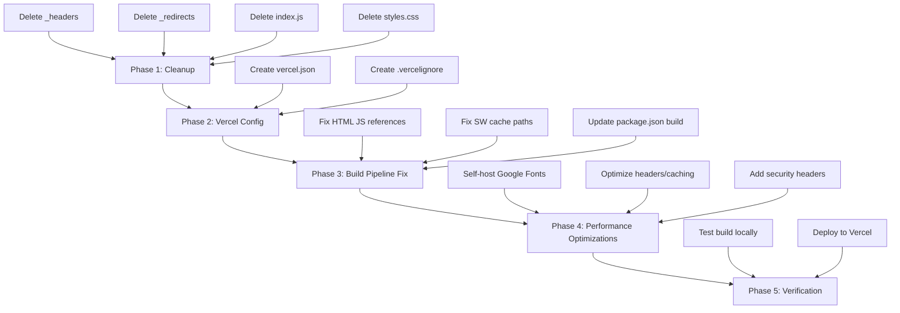

# Vercel Deployment & Optimization Plan

## Current State Analysis

### Architecture
- **Type**: Static multi-page site (index, library, feed, offline + book/policy/decision pages)
- **CSS**: Tailwind CSS v4.1.18 compiled via `@tailwindcss/cli` → [`dist/output.css`](dist/output.css)
- **JS**: Rollup bundles 3 entry points → [`dist/js/`](dist/js/) (index-main, library-main, feed)
- **Images**: Already optimized to WebP via Sharp
- **Service Worker**: [`sw.js`](sw.js) with cache-first strategy for static assets
- **Caching**: Multi-layer (memory → localStorage → IndexedDB) via [`js/unified-cache.js`](js/unified-cache.js)

### Problems Found

| Issue | File | Impact |
|-------|------|--------|
| Netlify-specific `_headers` file | [`_headers`](_headers) | Vercel ignores this; headers wont apply |
| Netlify-specific `_redirects` file | [`_redirects`](_redirects) | Vercel ignores this; redirects wont work |
| HTML references source JS not bundled JS | [`index.html:121`](index.html:121) | Serves unbundled code; Rollup output unused |
| Legacy deprecated [`index.js`](index.js) | [`index.js`](index.js) | Dead code; imports non-existent `registry.js` |
| Duplicate CSS at root | [`styles.css`](styles.css) | 56KB duplicate of `dist/output.css` |
| SW caches source paths not dist paths | [`sw.js:11`](sw.js:11) | Caches wrong files after build |
| Google Fonts loaded externally | [`index.html:31`](index.html:31) | Render-blocking; extra DNS + connection |
| No `vercel.json` config | - | No Vercel-specific optimizations |
| No `.vercelignore` | - | Deploys unnecessary files like `src/`, `scripts/`, `node_modules/` |
| No build command configured for Vercel | [`package.json`](package.json) | Vercel wont know how to build |
| Comment references GitHub Pages | [`_headers:34`](_headers:34) | Stale documentation |

---

## Plan Overview



---

## Phase 1: Cleanup — Remove Netlify/GitHub Pages Artifacts

### 1.1 Delete [`_headers`](_headers)
This is a Netlify-specific file. Vercel uses [`vercel.json`](vercel.json) for header configuration. All the security headers and cache-control rules will be migrated to `vercel.json`.

### 1.2 Delete [`_redirects`](_redirects)
This is a Netlify-specific file. Vercel uses `rewrites` and `redirects` in [`vercel.json`](vercel.json).

### 1.3 Delete [`index.js`](index.js)
This file is explicitly marked as `DEPRECATED` and imports from a non-existent `./js/registry.js`. It is dead code.

### 1.4 Delete [`styles.css`](styles.css)
This is a 56KB compiled Tailwind output sitting at the root. The actual build output is at [`dist/output.css`](dist/output.css). All HTML files already reference `dist/output.css`, so this root file is unused and confusing.

---

## Phase 2: Vercel Configuration

### 2.1 Create [`vercel.json`](vercel.json)

This is the core configuration file. It will include:

**Headers** — migrated from `_headers` with Vercel-specific enhancements:
- Security headers (X-Frame-Options, CSP, HSTS, etc.)
- Cache-Control with immutable for hashed assets
- Vercel automatically handles HTTP/2, Brotli, and Gzip — no config needed

**Rewrites** — migrated from `_redirects`:
- SPA fallback for unmatched routes
- Library query parameter handling

**Key Vercel free-tier benefits that work automatically:**
- ✅ HTTP/2 and HTTP/3 (QUIC) — automatic, no config
- ✅ Brotli + Gzip compression — automatic for all text assets
- ✅ Global Edge Network CDN — automatic
- ✅ Automatic HTTPS with TLS 1.3 — automatic
- ✅ Image optimization via `/_vercel/image` — available on free tier

### 2.2 Create [`.vercelignore`](.vercelignore)

Exclude files that should not be deployed:
- `src/` — source CSS files (only `dist/` needed)
- `scripts/` — build scripts
- `node_modules/` — handled by Vercel
- `*.md` files
- `plans/` directory
- Build stats (`dist/stats/`)
- `postcss.config.js`, `tailwind.config.js`, `rollup.config.mjs` — build-time only

---

## Phase 3: Build Pipeline Fix

### 3.1 Fix HTML JS References

Currently all HTML files reference source JS files:

```html
<!-- Current: references source files -->
<script type="module" src="js/index-main.js"></script>
<script type="module" src="js/marquee.js"></script>
```

These need to reference the Rollup-bundled output:

```html
<!-- Fixed: references bundled files -->
<script type="module" src="dist/js/index-main.js"></script>
```

**Files to update:**
- [`index.html`](index.html) — `js/index-main.js` + `js/marquee.js` → `dist/js/index-main.js`
- [`library.html`](library.html) — `js/library-main.js` + `js/marquee.js` → `dist/js/library-main.js`
- [`feed.html`](feed.html) — `js/feed.js` + `js/marquee.js` → `dist/js/feed.js`

**Note:** The marquee module is imported by each entry point through the module system, so separate `<script>` tags for `marquee.js` may be unnecessary if Rollup bundles it. Need to verify the Rollup output to confirm whether marquee is already included in the bundles or needs its own entry point.

### 3.2 Fix Service Worker Cache Paths

[`sw.js`](sw.js) currently caches source paths:

```js
const STATIC_CACHE_URLS = [
  '/',
  '/index.html',
  '/feed.html',
  '/library.html',
  '/offline.html',
  '/dist/output.css',        // ✅ Already correct
  '/images/admin-seal.webp', // ✅ Already correct
  '/images/favicon.png'      // ✅ Already correct
];
```

Need to add the bundled JS files to the static cache:
```js
'/dist/js/index-main.js',
'/dist/js/library-main.js',
'/dist/js/feed.js',
```

Also update the `getCacheStrategy()` function to handle `dist/js/` paths with cache-first strategy.

### 3.3 Update [`package.json`](package.json) Build Configuration

Add/update scripts for Vercel:

```json
{
  "scripts": {
    "build": "npm run build:css && npm run build:js",
    "vercel-build": "npm run build"
  }
}
```

Remove `build:images` from the default build since images are pre-committed as WebP. The image conversion script is a development utility, not a build step.

---

## Phase 4: Performance Optimizations

### 4.1 Self-Host Google Fonts

Currently loading Spectral font from Google Fonts CDN:
```html
<link href="https://fonts.googleapis.com/css2?family=Spectral:wght@400;500;600;700&display=swap" rel="stylesheet" />
```

**Optimization**: Download the font files and serve them locally. This eliminates:
- DNS lookup to `fonts.googleapis.com`
- Connection to `fonts.gstatic.com`
- Render-blocking external stylesheet
- Privacy concerns (Google tracking)

Steps:
1. Download Spectral WOFF2 files (400, 500, 600, 700 weights)
2. Create `fonts/` directory
3. Add `@font-face` declarations to the CSS source
4. Remove Google Fonts `<link>` tags from all HTML files
5. Remove `preconnect` hints for Google Fonts domains

### 4.2 Optimized Vercel Headers Strategy

```
Static assets (JS/CSS/images/fonts):
  Cache-Control: public, max-age=31536000, immutable

HTML files:
  Cache-Control: public, max-age=0, must-revalidate

JSON config files:
  Cache-Control: public, max-age=86400, stale-while-revalidate=3600

Service Worker:
  Cache-Control: public, max-age=0, must-revalidate
```

### 4.3 Security Headers via vercel.json

All security headers from the old `_headers` file will be migrated:
- `X-Frame-Options: DENY`
- `X-Content-Type-Options: nosniff`
- `Strict-Transport-Security` with preload
- `Content-Security-Policy` — updated to allow self-hosted fonts
- `Referrer-Policy`
- `Permissions-Policy`

### 4.4 Preload Hints Update

Update `<link rel="preload">` tags to reference `dist/js/` paths instead of `js/` paths. Remove preloads for Google Fonts domains if self-hosting.

---

## Phase 5: Verification

### 5.1 Local Build Test
```bash
npm run build
```
Verify that `dist/` contains all expected output files.

### 5.2 Deploy to Vercel
1. Connect GitHub repo to Vercel
2. Set build command: `npm run build`
3. Set output directory: `.` (root — this is a static site, not a framework)
4. Verify all pages load correctly
5. Run Lighthouse audit to confirm performance scores

---

## What Vercel Gives You for Free (No Config Needed)

| Feature | Status |
|---------|--------|
| HTTP/2 + HTTP/3 QUIC | ✅ Automatic |
| Brotli + Gzip compression | ✅ Automatic |
| Global Edge CDN (100+ locations) | ✅ Automatic |
| Automatic HTTPS + TLS 1.3 | ✅ Automatic |
| DDoS protection | ✅ Automatic |
| Preview deployments per PR | ✅ Automatic |
| Atomic deployments | ✅ Automatic |
| Instant rollbacks | ✅ Automatic |

---

## Files to Create

| File | Purpose |
|------|---------|
| [`vercel.json`](vercel.json) | Vercel deployment config with headers, rewrites, caching |
| [`.vercelignore`](.vercelignore) | Exclude dev files from deployment |
| `fonts/Spectral-*.woff2` | Self-hosted font files |

## Files to Delete

| File | Reason |
|------|--------|
| [`_headers`](_headers) | Netlify-specific; migrated to vercel.json |
| [`_redirects`](_redirects) | Netlify-specific; migrated to vercel.json |
| [`index.js`](index.js) | Deprecated dead code |
| [`styles.css`](styles.css) | Duplicate of dist/output.css |

## Files to Modify

| File | Changes |
|------|---------|
| [`index.html`](index.html) | Fix JS refs to dist/js/, remove Google Fonts link, add self-hosted font preload |
| [`library.html`](library.html) | Same as above |
| [`feed.html`](feed.html) | Same as above |
| [`offline.html`](offline.html) | Remove Google Fonts link, add self-hosted font |
| [`sw.js`](sw.js) | Add dist/js/ to static cache, update cache strategy |
| [`package.json`](package.json) | Update build script, remove build:images from default build |
| [`src/styles/_variables.css`](src/styles/_variables.css) | Add @font-face for self-hosted Spectral |
| All book/policy/decision HTML pages | Remove Google Fonts link if present, reference self-hosted |

---

## Vercel Free Tier Limits to Be Aware Of

| Resource | Limit |
|----------|-------|
| Bandwidth | 100 GB/month |
| Builds | 6000 minutes/month |
| Serverless Functions | 100 GB-hours/month |
| Deployments | Unlimited |
| Custom Domains | Unlimited |
| Team Members | 1 (Hobby plan) |

Your site is fully static, so serverless function limits dont apply. The main constraint is **100 GB/month bandwidth**. Your total image assets are ~1.3 MB which is very reasonable.
